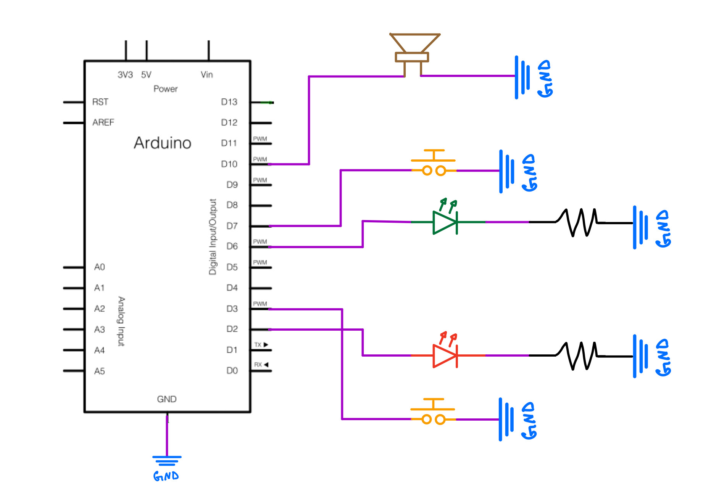
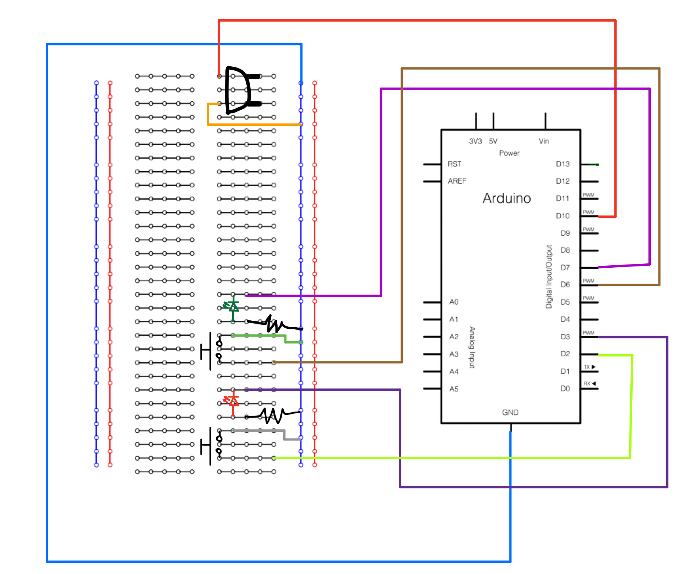
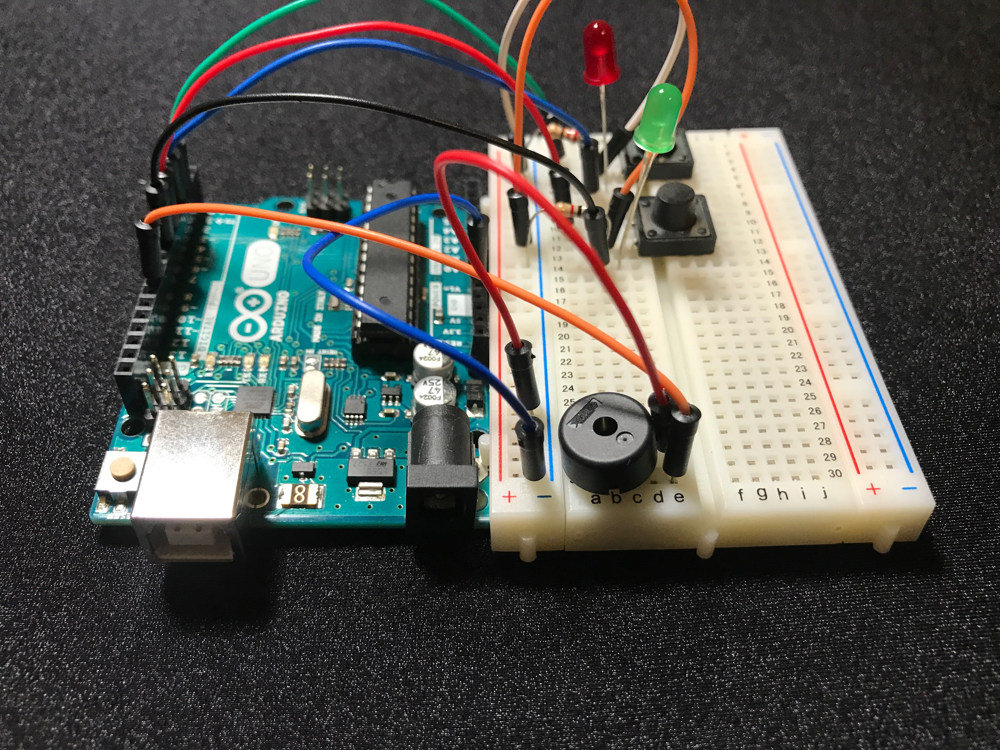
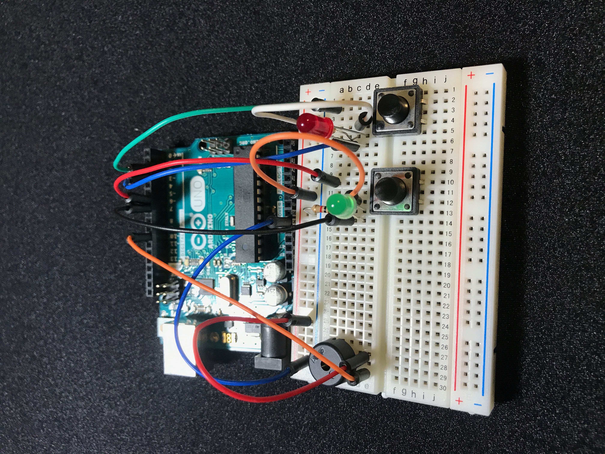
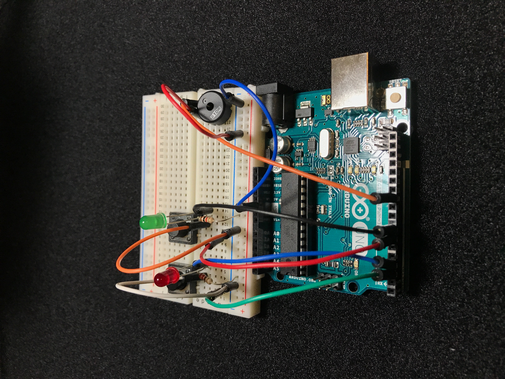
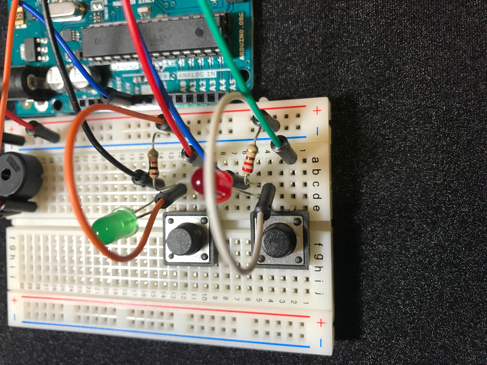
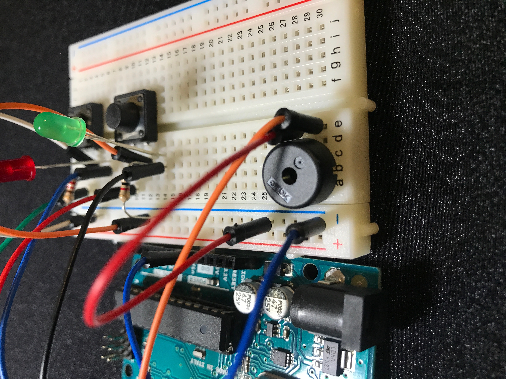

# Simon Game
Course EE296 (Sophmore Projects)

[Example of Simon Game (Youtube)](https://youtu.be/nzIGjw8b3Vo)

## Background
Simple simon game (Arduino memory game)

LED will light up in random pattern, Player needs to memorize pattern and push button to match pattern.

## Equipment
2 Buttons

2 Light Emitting Diodes

1 Buzzer/speaker

2 1k resistors

1 Arduino uno

9 wires

## Schematics

## Examples

